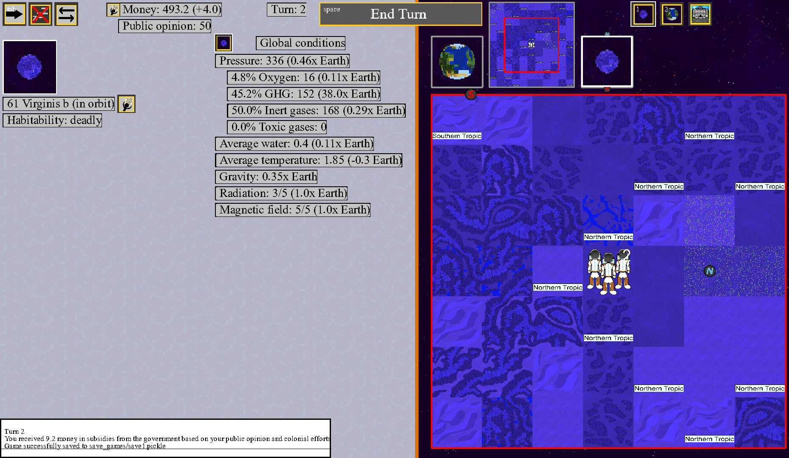

Second Earth - a game simulating human colonization of another world

I enjoy contributing here in my free time - feel free to reach out for installation/build instructions, or just to chat. This is a multi-year project that I fully intend to finish.

Welcome to Second Earth!

I consider realism among the most important goals of this game, and I have striven to be realistic in each part of its implementation - this should be a scientifically accurate simulation of a possible future for humanity. However, some concessions have been made for gameplay or development time. For example, while our wrap-around square coordinate system can be simply implemented and functions well for most purposes, it causes some regions to be adjacent to ones that should on the other side of the planet and makes it impossible to accurately project the map onto a sphere.